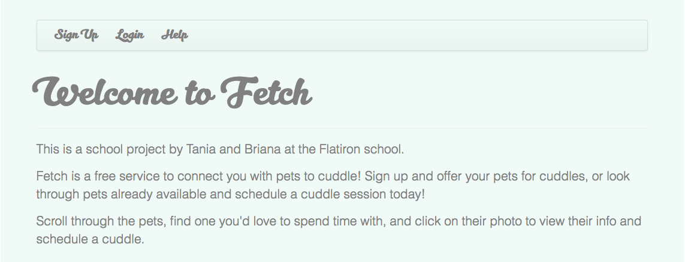

# Fetch

Flatiron School Mod 2 final project. It's a free "cuddle buddy" pet service, connecting humans seeking cuddles to cuddly creatures. 

-[Fetch Demo Video](https://youtu.be/8c3Kuuif0fQ)

## Built With

* Ruby on Rails 
* Photo uploads with carrierwave

## Prerequisites

* Ruby v5.1.4

## Setup 

1. Clone this repo - https://github.com/tanelam/fetch
2. Install gems `bundle install`
3. Setup Database `rake db:create`, then run `rake db:migrate`
5. Seed Database `rake db:seed`
4. Start your server `rails s` 
5. Navigate to http://localhost:3000 

## Contributors 
* [Briana Baker](https://github.com/brianabaker/)
* [Tania Aparicio](https://github.com/tanelam)
